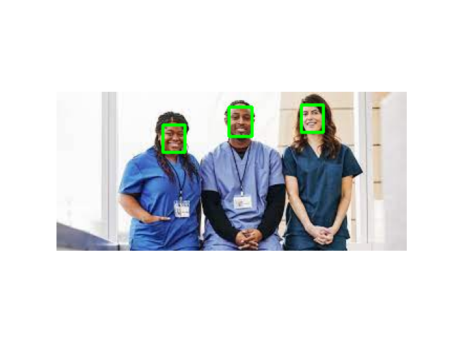

# biasCrawler
in AI ethics class, Web crawl + FaceDection = CREDIT

First, complete the job.csv file. This is the name of the query to be searched in the Google Image Search window. In my case, I put about 50 jobs in English-Korean, but it doesn't matter if it's not a job if it's something to search for.

  <table>
    <thead>
      <tr>
        <th align="center">English</th>
        <th align="center">Korean</th>
      </tr>
    </thead>
    <tbody>
      <tr>
        <td align="center">Software Developer</td>
        <td align="center">소프트웨어 개발자</td>
      </tr>
      <tr>
        <td align="center">Data Scientist</td>
        <td align="center">데이터 과학자</td>
      </tr>
      <tr>
        <td align="center">Mechanical Engineer</td>
        <td align="center">기계 공학자</td>
      </tr>
      <tr>
        <td align="center">Civil Engineer</td>
        <td align="center">토목 엔지니어</td>
      </tr>
      <tr>
        <td align="center">Electrical Engineer</td>
        <td align="center">전기 엔지니어</td>
      </tr>
      <tr>
        <td align="center">Nurse</td>
        <td align="center">간호사</td>
      </tr>
      <tr>
        <td align="center">Doctor</td>
        <td align="center">의사</td>
      </tr>
      <tr>
        <td align="center">Pharmacist</td>
        <td align="center">약사</td>
      </tr>
      <tr>
        <td align="center">Dentist</td>
        <td align="center">치과 의사</td>
      </tr>
    </tbody>
  </table>

After that, the initial screen (job_JOBNAME_img00.png) searched in each directory and the first to 20th pictures (job_JOBNAME_img00.png ~ job_JOBNAME_img20.png) are added to each directory as a png file.

  
  
  
  
  
  

After that, the race and gender of the extracted face image for each photo are analyzed using the Deepface model. Make the analysis result back to the csv file.

  
  
  
  
  

Although the detector's performance is not encouraging, it did a great job of crawling, and if you learn more about the detector, you can expect performance improvement. Please look forward to the future!

  <table>
    <thead>
      <tr>
        <th align="center">Occupation</th>
        <th align="center">ID</th>
        <th align="center">Rank</th>
        <th align="center">Gender</th>
        <th align="center">Ethnicity</th>
      </tr>
    </thead>
    <tbody>
      <tr>
        <td align="center">Nurse</td>
        <td align="center">01</td>
        <td align="center">1.0</td>
        <td align="center">Woman</td>
        <td align="center">latino hispanic</td>
      </tr>
      <tr>
        <td align="center">Nurse</td>
        <td align="center">02</td>
        <td align="center">2.0</td>
        <td align="center">Man</td>
        <td align="center">black</td>
      </tr>
      <tr>
        <td align="center">Nurse</td>
        <td align="center">02</td>
        <td align="center">2.0</td>
        <td align="center">Woman</td>
        <td align="center">white</td>
      </tr>
      <tr>
        <td align="center">Nurse</td>
        <td align="center">03</td>
        <td align="center">1.0</td>
        <td align="center">Man</td>
        <td align="center">black</td>
      </tr>
      <tr>
        <td align="center">Nurse</td>
        <td align="center">04</td>
        <td align="center">1.0</td>
        <td align="center">Woman</td>
        <td align="center">white</td>
      </tr>
      <tr>
        <td align="center">Nurse</td>
        <td align="center">05</td>
        <td align="center">1.0</td>
        <td align="center">Woman</td>
        <td align="center">white</td>
      </tr>
    </tbody>
  </table>

